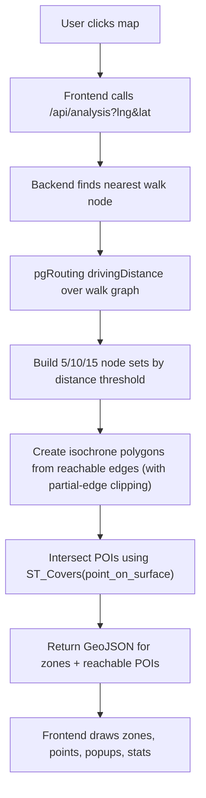

# Lahore 15-Minute City (Walkability Analysis)

This project calculates walkable access from a clicked point in Lahore and returns:

1. 5-minute isochrone
2. 10-minute isochrone
3. 15-minute isochrone
4. POIs that are reachable inside those polygons

It is built with:

- `backend-dotnet`: ASP.NET Core + PostgreSQL/PostGIS + pgRouting
- `frontend/Lahore-frontend`: React + Vite + MapLibre

## 1) End-to-End Flow

## 2) Backend Processing Logic

Primary file:

- `backend-dotnet/Controllers/AnalysisController.cs`

Main processing steps per request:

1. Validate request parameters (`lng`, `lat`, speed, edge buffer)
2. Ensure routing objects/indexes exist (`postgis`, `pgrouting`, routing table, indexes)
3. Snap click location to nearest graph node in `walk_nodes`
4. Run `pgr_drivingDistance` on `walk_edges_routing`
5. Split reachable nodes into distance thresholds for 5/10/15 min
6. Build polygons with:
   - reachable graph edges from `pgr_drivingDistance`
   - partial-edge clipping for exact threshold boundaries
   - corridor buffering + cleanup (`ST_MakeValid`, polygon extraction)
   - road-line subdivision to produce block-style zone pieces
7. Select POIs inside polygons using:
   - `ST_PointOnSurface(p.geometry)` for robust point representation
   - `ST_Covers(zone.geom, poi_point)`
8. Return JSON with:
   - `isochrones` (FeatureCollection with 5,10,15)
   - `isochrone` (15-min compatibility output)
   - `reachablePois` (filtered points, tagged by `zone_minutes`)

## 3) API Contract

`GET /api/analysis?lng={number}&lat={number}`

Response (important keys):

- `isochrones`: FeatureCollection, each feature has `properties.minutes`
- `reachablePois`: FeatureCollection, each POI has:
  - `name`
  - `amenity`
  - `leisure`
  - `shop`
  - `zone_minutes`
- `metadata`: speed, max distance, nearest node

Other endpoints:

- `GET /api/boundary` -> Lahore boundary feature
- `GET /api/pois` -> full POI dataset feature collection

## 4) Frontend Behavior

Primary files:

- `frontend/Lahore-frontend/src/components/MapView.jsx`
- `frontend/Lahore-frontend/src/hooks/usePoisLayer.js`
- `frontend/Lahore-frontend/src/hooks/useBoundaryLayer.js`
- `frontend/Lahore-frontend/src/components/LayerPanel.jsx`

Frontend workflow:

1. Initialize MapLibre basemap
2. Load Lahore boundary layer
3. On click:
   - request analysis from backend
   - draw 15/10/5 zones
   - draw reachable POIs
   - center/focus map to 15-minute polygon
4. Side panel controls:
   - category toggles (healthcare, schools, parks, transit, markets)
   - summary counts by zone
   - clear/reset controls
5. POI popup shows tags + assigned zone

## 5) Required Database Objects

Expected tables:

- `walk_nodes` (`osmid`, `geometry`)
- `walk_edges` (`u`, `v`, `length`, `geometry`)
- `lahore_pois` (`name`, `amenity`, `leisure`, `shop`, `geometry`)
- `lahore_boundary` (`geometry`)

Generated by backend (if missing):

- `walk_edges_routing` with `source`, `target`, `cost`, `reverse_cost`, `geom`

Required extensions:

- `postgis`
- `pgrouting`

## 6) Run Instructions

### Backend

1. Open terminal in `backend-dotnet`
2. Confirm DB connection in `appsettings.json` (or fallback string in controller)
3. Run:
   - `dotnet restore`
   - `dotnet run`

Default backend URL used by frontend: `http://localhost:5109`

### Frontend

1. Open terminal in `frontend/Lahore-frontend`
2. Run:
   - `npm install`
   - `npm run dev`
3. Open URL shown by Vite (usually `http://localhost:5173`)

Optional environment variable:

- `VITE_API_BASE_URL=http://localhost:5109`

## 7) Tuning Notes

- `walkingSpeedMetersPerMinute` controls travel distance thresholds.
- `edgeBufferMeters` controls service-area corridor thickness around reachable streets.
- For sharper network-following edges, reduce `edgeBufferMeters`; for fuller coverage, increase carefully.
- Keep GIST/BTREE indexes present for fast response.

## 8) Troubleshooting

- No zones returned:
  - verify click lies near loaded walking graph area
  - verify `walk_nodes` / `walk_edges` contain geometries
- POIs outside polygons:
  - confirm backend response source is `reachablePois` only
  - verify frontend uses this source (not full `/api/pois`)
- Slow responses:
  - confirm routing table/indexes exist
  - run DB `ANALYZE` on graph/POI tables
